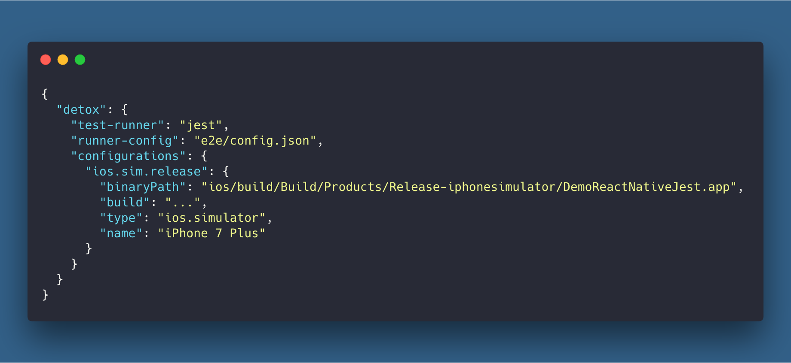
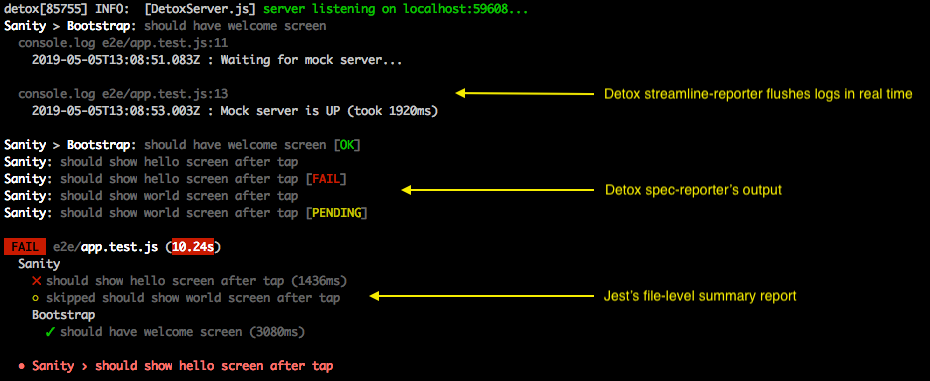

# Jest

This guide describes how to install [Jest](http://jestjs.io/) as the test runner to be used by Detox for effectively running the E2E tests (i.e. instead of the default runner, which is Mocha).

## Disclaimer

- The guide describes installing Detox with Jest on a _fresh project_. If you're migrating an existing project, use the guide but please apply some common sense in the process.

- The guide has been officially tested only with Jest 24.x.x. We cannot guarantee that everything would work with older versions.

## Introduction

As already mentioned in the [Getting Started](Introduction.GettingStarted.md#step-3-create-your-first-test) guide, Detox itself does not effectively run tests logic, but rather delegates that responsibility onto a test runner. Jest is the recommended runner for projects with test suites that have become large enough so as to require parallel execution.

Do note that in turn, Jest itself - much like Detox, also does not effectively run any tests; Rather, it is more of a dispatcher and orchestrator of multiple instances of a delegated runner, capable of running in parallel (for more info, refer to [this video](https://youtu.be/3YDiloj8_d0?t=2127); source: [Jest architecture](https://jestjs.io/docs/en/architecture)). Currently, by default, the concrete runner is `jasmine v2`, but Jest's own project called [jest-circus](https://github.com/facebook/jest/tree/master/packages/jest-circus) is becoming more and more stable. In a way, we even recommend using it over `jasmine`  because of bugs in `jasmine` that are not maintained ([this one](https://github.com/facebook/jest/issues/6755) in particular).

**The guide initially describes the setup of Jest in its default settings (i.e. using `jasmine`).** For applying `jest-circus`, refer to the end of the installation section.

## Installation

### 0. Set up Detox' fundamentals

Before starting out with Jest, please be sure to go over the fundamentals of the [Getting Started](Introduction.GettingStarted.md) guide.

### 1. Install Jest

```sh
npm install --save-dev jest
```

### 2. Set up test-code scaffolds

#### Run an automated init script:

```sh
detox init -r jest
```

> Errors occurring in the process may appear in red.

#### Fix & Verify

Even if `detox init` goes well and everything is green, we recommend going over some fundamental things, using our homebrewed [`demo-react-native-jest`](https://github.com/wix/Detox/tree/master/examples/demo-react-native-jest) example project as a reference.

##### a. Fix/verify this list of JSON properties:


| File                                                         | Property               | Value                                          | Description                                                  |
| ------------------------------------------------------------ | ---------------------- | ---------------------------------------------- | ------------------------------------------------------------ |
| [**`package.json`**](https://github.com/wix/Detox/blob/master/examples/demo-react-native-jest/package.json#L25) | `detox.test-runner`    | `"jest"`                                       | *Required.* Should be `"jest"` for the proper `detox test` CLI functioning. |
|                                                              | `detox.runner-config ` | (optional path to Jest config file)            | *Optional.* This field tells `detox test` CLI where to look for Jest's config file. If omitted, the path defaults to "e2e/config.json" (a file generated by `detox init -r jest`). |
| [**`e2e/config.json`**](https://github.com/wix/Detox/blob/master/examples/demo-react-native-jest/e2e/config.json) | `testEnvironment `     | `"node"`                                       | *Required*. Needed for the proper functioning of Jest and Detox. |
|                                                              | `setupFilesAfterEnv `  | `["./init.js"]`                                | *Required*. Indicates which files to run before each test suite. The field was [introduced in Jest 24](https://jestjs.io/docs/en/configuration#setupfilesafterenv-array). |
|                                                              | `reporters`            | ["detox/runners/<br/>jest/streamlineReporter"] | *Optional.* Available since  Detox `12.7.0`. Sets up our highly recommended `streamline-reporter` [Jest reporter](https://jestjs.io/docs/en/configuration#reporters-array-modulename-modulename-options), tailored for running end-to-end tests in Jest - which in itself was mostly intended for running unit tests. For more details, [see the migration guide](Guide.Migration.md#migrating-to-1270-from-older-nonbreaking). |
|                                                              | `verbose`              | `true`                                         | Must be `true` if you have replaced Jest's `default` reporter with Detox's `streamlineReporter`. Optional otherwise. |

A typical detox configuration in a `package.json`file:



##### b. Fix/verify the custom Jest init script (i.e. [`e2e/init.js`](https://github.com/wix/Detox/blob/master/examples/demo-react-native-jest/e2e/init.js)):

- `beforeAll()`, `beforeEach()`, `afterAll()` should be registered as hooks
  for invoking `detox` and/or a custom adapter.
- The custom Detox-Jest adapter must be registered as a `jasmine` reporter (`jasmine.getEnv().addReporter()`). It is required for the [artifacts subsystem](APIRef.Artifacts.md) to properly work.
- (Recommended) Starting Detox `12.7.0`, an additional, custom `spec-reporter` should be registered as a `jasmine` reporter, as well. This one takes care of logging on a per-spec basis (i.e. when `it`'s start and end) — which Jest does not do by default.
  Should be used in conjunction with the Detox-Jest adapter.

A typical Jest log output, having set up `streamline-reporter` in `config.json` and `spec-reporter` in `init.js`:



### 3. Applying `jest-circus` (optional)

> * Requires Detox >= 14.3.0 !!!
>
> * Requires Jest & jest-circus version >= 24.9.0 !!!

By reaching this point you effectively have Jest set up and ready to launch in its default settings - i.e. with `jasmine` as its default test runner. However, `jasmine` can be switched with `jest-circus` as a drop-in replacement. To do so, apply these changes:

##### a. Install jest-circus

```sh
npm install --save-dev jest-circus
```

> Make sure jest and jest-circus' versions match (e.g. both are 24.9.0)

##### b. Update jest's config

In `e2e/config.json`, apply this change:

```diff
// e2e/config.json

{
-    "testEnvironment": "node"
+    "testEnvironment": "detox/runners/jest/JestCircusEnvironment",
+    "testRunner": "jest-circus/runner"

...
}
```

##### c. Update init script

In `e2e/init.js`, as explained in the previous section, we typically register the main adapter and various reporters directly do `jasmine`. Since `jest-circus` **replaces** `jasmine`, we've set up a custom circus-associated API to replace `jasmine.getEnv().addReporter()` calls, namely: `detoxCircus.getEnv().addEventsListener()`. You must have all associated calls replaced. Example:

```diff
// e2e/init.js

const adapter = require('detox/runners/jest/adapter');
const workerAssignReporter = require('detox/runners/jest/assignReporter');
const specReporter = require('detox/runners/jest/specReporter');

-jasmine.getEnv().addReporter(adapter);
-jasmine.getEnv().addReporter(workerAssignReporter);
-jasmine.getEnv().addReporter(specReporter);
+detoxCircus.getEnv().addEventsListener(adapter);
+detoxCircus.getEnv().addEventsListener(assignReporter);
+detoxCircus.getEnv().addEventsListener(specReporter);
```

Once again, use our [jest demo-suite's init.js](https://github.com/wix/Detox/blob/jest-circus/examples/demo-react-native-jest/e2e/init-circus.js#L10) as a reference.

## Writing Tests

There are some things you should notice:

- Don't worry about mocks being used, Detox works on the compiled version of your app.
- Detox exposes it's primitives (`expect`, `device`, ...) globally, it will override Jest's global `expect` object.

## Parallel Test Execution

Through Detox' cli, Jest can be started with [multiple workers](Guide.ParallelTestExecution.md) that run tests simultaneously. In this mode, Jest effectively assigns one worker per each test file (invoking Jasmine over it). In this mode, the per-spec logging offered by the `spec-reporter` mentioned earlier, does not necessarily make sense, as the workers' outputs get mixed up.

By default, we disable `spec-reporter` in a multi-workers environment. If you wish to force-enable it nonetheless, the [`--jest-report-specs`](APIRef.DetoxCLI.md#test) CLI option can be used.

## How to run unit test and E2E tests in the same project

- If you have a setup file for the unit tests pass `./jest/setup` implementation into your unit setup.
- Call your E2E tests using `detox-cli`: `detox test`